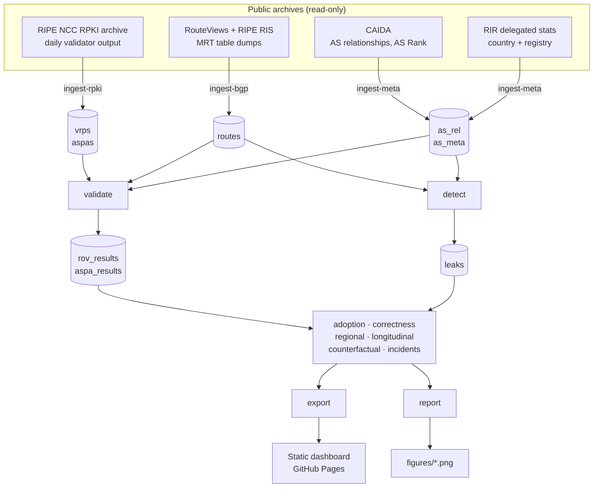

<div align="center">

# BGPShield

**Measuring how much of the internet's routing has actually been vouched for.**

A reproducible, passive-measurement pipeline for RPKI Route Origin Validation and ASPA adoption.

[](https://github.com/TanishkaJ26/BGPShield/actions/workflows/ci.yml)
[](https://github.com/TanishkaJ26/BGPShield/actions/workflows/daily-site.yml)
[](LICENSE)
[](https://www.python.org/)
[](tests/)
[](#ethics-and-safety)

**[→ Live dashboard](https://tanishkaj26.github.io/BGPShield/)** · [Findings](#-what-we-found) · [Quick start](#-quick-start) · [Commands](#-command-reference) · [Reproduce it](#-reproducing-the-numbers)

</div>

---

## The one-paragraph version

Every packet on the internet travels a path that no one has to justify. Two mechanisms exist to
change that: **RPKI** lets an address holder state which network may announce its addresses, and
**ASPA** lets a network state who its upstream providers are. BGPShield measures how far those
two have actually got, using only data that public archives already recorded. The headline is
that adoption numbers flatter the reality: **2.87%** of routed networks publish an ASPA record,
but only **5.41%** of routes contain two *adjacent* publishers, which is the first point at
which ASPA can judge anything at all.

> [!NOTE]
> This is a **research measurement project**, not a product. Correctness and reproducibility
> matter more than features. Every number on the dashboard can be re-derived from the archives
> with one command, and every caveat travels with the number it qualifies.

---

## Contents

| Section | What is in it |
| --- | --- |
| [New to BGP?](#-new-to-bgp-start-here) | Plain-English explanation of BGP, RPKI and ASPA |
| [What we found](#-what-we-found) | The four research questions and their answers |
| [How it works](#-how-it-works) | The pipeline, stage by stage |
| [Quick start](#-quick-start) | Install and run in five minutes |
| [Command reference](#-command-reference) | All fifteen commands, with examples |
| [Data sources](#-data-sources) | Every archive used, and what was verified |
| [Reproducing the numbers](#-reproducing-the-numbers) | The acceptance check anyone can run |
| [The dashboard](#-the-dashboard) | Building and deploying the site |
| [Repository layout](#-repository-layout) | What lives where |
| [Development](#-development) | Tests, linting, types |
| [Limitations](#-limitations-read-this-before-quoting-anything) | What these numbers cannot tell you |
| [Glossary](#-glossary) | Every acronym, defined |
| [Troubleshooting](#-troubleshooting) | Common problems |

---

## 🌐 New to BGP? Start here

<details>
<summary><b>What is BGP, and why does any of this matter?</b> (click to expand)</summary>

<br>

The internet is a few hundred thousand allocated networks, of which roughly **86,000 actively
announce routes** on any given day. Each one is called an **Autonomous System**, or AS, and has a
number: AS15169 is Google, AS9498 is Bharti Airtel. To reach each other they
run the **Border Gateway Protocol** (BGP, [RFC 4271](https://www.rfc-editor.org/rfc/rfc4271)),
which is essentially networks shouting "I can reach these addresses, and here is the list of
networks the announcement passed through".

That list is the **AS\_PATH**. There is no cryptography in it and no authority checking it. If a
network announces addresses it does not own, or passes on a route it was not paid to carry, BGP
has historically had no way to tell. Both happen, sometimes by accident and sometimes not.

Two failure modes matter here:

| Failure | What happens | Real example |
| --- | --- | --- |
| **Origin hijack** | A network announces addresses it does not hold, so traffic goes to the wrong place | 2018: Amazon's DNS addresses were announced by another network, and MyEtherWallet users were redirected to an attacker |
| **Route leak** | A network passes on a route it should have kept to itself, so traffic detours through a network too small to carry it | 2019: a route optimiser at DQE sent more-specific routes to Verizon, which propagated them worldwide and knocked large parts of the internet offline |

</details>

<details>
<summary><b>What are RPKI and ROV?</b></summary>

<br>

**RPKI** is the Resource Public Key Infrastructure ([RFC 6480](https://www.rfc-editor.org/rfc/rfc6480)).
An address holder signs a statement called a **ROA**, a Route Origin Authorisation, saying "AS
number X may announce this block of addresses, down to prefix length L".

A validator checks the signatures on every ROA and flattens them into simple triples called
**VRPs**, Validated ROA Payloads. **Route Origin Validation**
([RFC 6811](https://www.rfc-editor.org/rfc/rfc6811)) then compares a route against them and
returns one of three answers:

- **Valid** — a VRP covers this prefix and the origin matches.
- **Invalid** — a VRP covers this prefix but the origin is wrong, or the prefix is more specific
  than the maximum length allowed.
- **Not found** — no VRP covers this prefix at all. This is the majority of the internet.

ROV only checks **who announced it**. It says nothing about the path the announcement travelled,
so it cannot see a route leak at all.

</details>

<details>
<summary><b>What is ASPA, and why is it different?</b></summary>

<br>

**ASPA** is an Autonomous System Provider Authorization. A network signs a statement listing its
**upstream providers**: "these are the networks I pay for transit". A receiver can then check
whether a path makes commercial sense, which is what catches a route leak.

The specification is still an Internet-Draft, not an RFC. This project pins
[`draft-ietf-sidrops-aspa-verification-28`](https://www.ietf.org/archive/id/draft-ietf-sidrops-aspa-verification-28.txt)
and [`draft-ietf-sidrops-aspa-profile-29`](https://www.ietf.org/archive/id/draft-ietf-sidrops-aspa-profile-29.txt);
see [`docs/references.md`](docs/references.md) for exactly which version every rule came from.

**The crucial property, and the reason for this project's headline finding:** an ASPA record can
only settle a hop when the networks on **both sides** of that hop publish. One record alone
proves nothing about the hop next to it. So value appears only where two publishers happen to
land beside each other, and scattered adoption composes badly.

</details>

<details>
<summary><b>A note on path direction, which is the easiest thing to get wrong</b></summary>

<br>

A BGP AS\_PATH as received reads **neighbour first, origin last**: each AS prepends its own
number as the route passes, so the leftmost entry is the most recent hop
([RFC 4271 §4.3](https://www.rfc-editor.org/rfc/rfc4271#section-4.3)).

The ASPA verification draft numbers paths **the other way round**, with AS(1) as the origin
(§5.2). So this project normalises everything to **origin first**: `as_path[0]` is the origin AS
and `as_path[-1]` is the collector's peer. This is stated in
[`src/bgpshield/paths.py`](src/bgpshield/paths.py), in the plan, and in `CLAUDE.md`, because
mixing it up is the single most likely bug in the whole codebase.

</details>

---

## 📊 What we found

Measured on the routing snapshot of **2026-09-01**, from **six collectors**, against the RPKI
snapshot of the same day.

### RQ1 — How far has adoption actually got?

| Measure | Value | What it means |
| --- | ---: | --- |
| Routed networks publishing an ASPA record | **2.87%** | 2,484 of 86,658 |
| Routes touching a publisher **anywhere** on the path | **39.60%** | the number most often quoted |
| Routes with two **adjacent** publishers | **5.41%** | the first point ASPA can judge a hop |
| Routes covered **end to end** | **0.05%** | ASPA as designed, almost nowhere yet |

> [!IMPORTANT]
> Quoting 39.6% alone overstates deployable coverage by about sevenfold. The two numbers have to
> be read together, which is why the dashboard always shows them side by side.

### RQ2 — Are the published records actually correct?

| Measure | Value |
| --- | ---: |
| Publishers missing at least one inferred provider | **13.1%** (369 of 2,822) |
| ASPA-Invalid routes that look perfectly well formed | **17.7%** |

Roughly **one in five** ASPA-Invalid routes is better explained by an incomplete published
record than by anything wrong with the routing. This is a statement about **ASPA**, not about
origin validation; ROV-Invalid is a different and much smaller set.

### RQ3 — Would ASPA have stopped real incidents?

| Measure | Value |
| --- | ---: |
| Curated, documented incidents | **7** |
| Of those, route leaks a path-based detector could ever see | **4** |
| Actually judgeable from the collectors used | **2** |
| Detected | **2 of 2** |
| Leak-detector precision, sampled | **46%** |

Two of two is a count, not a recall estimate. That only **2 of 7** well-documented incidents
could be judged at all is itself the result: the limiting factor is where the vantage points
are, not the detector.

### RQ4 — Where is adoption missing most?

**None of India's thirteen largest transit networks publishes an ASPA record.** The largest that
does is AS9885, with a customer cone of 85 and a global rank of 536. The largest Indian network
overall, AS9498, ranks **20th in the world** and publishes nothing.

| Region | Publishing | Routed | Share |
| --- | ---: | ---: | ---: |
| Global | 2,484 | 86,658 | 2.87% |
| APNIC region | 202 | 20,169 | 1.00% |
| Registered in India | 54 | 2,931 | 1.84% |

A record from a large transit network protects everything in its customer cone. One from a
network at the edge covers a single hop. **Adoption is happening where it does the least good.**

---

## ⚙️ How it works



Every stage writes **partitioned Parquet** under `data/`, so any stage can be re-run without
redoing the ones before it. Nothing under `data/` is ever committed.

<details>
<summary><b>Why the topology comes from the month before</b></summary>

<br>

Relationship data is deliberately taken from the month *before* a routing snapshot, so the
topology used to judge a route was not inferred from the routes being judged. This is the rule
in the plan, Section 10.4, and it is why `validate` and `detect` default to the previous month.

</details>

---

## 🚀 Quick start

### Prerequisites

- **Python 3.12** (exactly; the lockfile pins to `>=3.12,<3.13`)
- **[uv](https://docs.astral.sh/uv/)** for the environment and lockfile
- **Node 22+** and npm, only if you want to build the dashboard

### Install

```bash
git clone https://github.com/TanishkaJ26/BGPShield.git
cd BGPShield
uv sync                 # creates .venv/ from the lockfile
uv run bgpshield version # -> bgpshield 1.0.0
```

<details>
<summary><b>Running it without typing <code>uv run</code> every time</b></summary>

<br>

```powershell
# Windows PowerShell
.\.venv\Scripts\Activate.ps1
bgpshield --help
```

```bash
# Git Bash, macOS, Linux
source .venv/bin/activate      # .venv/Scripts/activate on Windows
bgpshield --help
```

Without activating, call it by path (`.venv\Scripts\bgpshield.exe --help`) or run
`python -m bgpshield`.

</details>

### Your first real measurement

This fetches one day of published RPKI records, about 4 MB across the five trust anchors, and reports adoption:

```bash
uv run bgpshield ingest-rpki --date 2026-09-16
uv run bgpshield adoption
```

> [!TIP]
> The command works from **any directory**. It finds `config/default.yaml` by searching upwards
> from where you started it, falling back to the checkout it was installed from. Override with
> `--config` or the `BGPSHIELD_CONFIG` environment variable. Add `--verbose` to any command to
> watch every download attempt and retry on stderr.

---

## 📟 Command reference

All fifteen commands. Every one takes `--config`; the global `--verbose` goes before the
subcommand.

| Command | What it does |
| --- | --- |
| `version` | Print the package version |
| `ingest-rpki` | Download RPKI validator output into the `vrps` and `aspas` tables |
| `ingest-bgp` | Ingest one routing-table dump per collector into `routes` |
| `ingest-meta` | Build the `as_rel` and `as_meta` tables for one month |
| `validate` | Run origin and ASPA validation over stored routes |
| `detect` | Find route leaks in stored routes |
| `adoption` | **RQ1** — ASPA adoption over time, per trust anchor, per country |
| `correctness` | **RQ2** — how complete published records are, and what gaps cost |
| `counterfactual` | **RQ3** — would ASPA have stopped these leaks, and where |
| `incidents` | **RQ3** — replay curated real incidents against the detector |
| `regional` | **RQ4** — one country and its region against the world |
| `longitudinal` | Aggregates across every validated snapshot date |
| `report` | Regenerate all seven paper figures into `figures/` |
| `export` | Write the dashboard JSON the site reads |
| `reproduce` | Re-derive one date and check it against committed fixtures |

<details>
<summary><b>Worked examples for every command</b></summary>

<br>

**Ingest RPKI records**, one day or a backfill:

```bash
uv run bgpshield ingest-rpki --date 2026-09-16
uv run bgpshield ingest-rpki --from 2023-10-11 --to 2026-09-18 --every 7d
```

`2023-10-11` is the first day any ASPA record existed anywhere, verified in Phase 0.

**Ingest routing tables.** One dump per collector; `--limit` is for smoke runs:

```bash
uv run bgpshield ingest-bgp --date 2026-09-01 --collectors rrc06
uv run bgpshield ingest-bgp --date 2026-09-01            # all six configured collectors
```

**Build topology** for a month (slow; `--skip-asrank` avoids the long AS Rank walk):

```bash
uv run bgpshield ingest-meta --month 2026-08
```

**Validate and detect.** Relationships default to the month before the snapshot:

```bash
uv run bgpshield validate --date 2026-09-01 --collectors rrc06
uv run bgpshield detect   --date 2026-09-01 --collectors rrc06
```

**The analyses:**

```bash
uv run bgpshield adoption --export web/public/data/aspa_adoption.json
uv run bgpshield correctness --date 2026-09-01 --top 20
uv run bgpshield regional --date 2026-09-01 --country IN --top 15
uv run bgpshield counterfactual --date 2026-09-01 --scenarios S0,S1,S2,S3
uv run bgpshield incidents --list          # show the curated list, fetch nothing
uv run bgpshield longitudinal --csv series.csv
```

**Outputs:**

```bash
uv run bgpshield report     # seven figures into figures/
uv run bgpshield export     # dashboard JSON into web/public/data/
```

</details>

<details>
<summary><b>Counterfactual scenarios explained</b></summary>

<br>

`counterfactual` replays each detected leak under different assumptions about who publishes and
who filters.

| Scenario | Who has published a record |
| --- | --- |
| **S0** | Only the networks that really published on that date |
| **S1** | S0 plus synthetic records for the 100 largest networks by customer cone |
| **S2** | S0 plus the largest 1,000 |
| **S3** | Every network. **Upper bound only** |

| Filtering | Who actually drops Invalid routes |
| --- | --- |
| **F-all** | Every network on the path |
| **F-top20** | Only the 20 largest transit networks |
| **F-top100** | Only the largest 100 |

> [!WARNING]
> S3 gives every network a synthetic record copied from the inferred topology, and the leaks
> were detected using that same topology. S3 is therefore an **upper bound, not a prediction**,
> and every S3 row is flagged as such in the output and the stored table.

</details>

---

## 🗄️ Data sources

Everything is a public archive that already recorded this data. **Nothing is scanned, probed or
requested from any operator's network.** Each source was verified against a real download in
Phase 0; see [`docs/data-sources.md`](docs/data-sources.md) for the sample records and formats.

| Source | Used for | Cadence | Notes |
| --- | --- | --- | --- |
| [RIPE NCC RPKI archive](https://ftp.ripe.net/rpki) | VRPs and ASPA records | Daily | Routinator JSON, all five trust anchors |
| [RouteViews](http://archive.routeviews.org/) + [RIPE RIS](https://data.ris.ripe.net/) | Routing table dumps | 2–8 hourly | MRT format, [RFC 6396](https://www.rfc-editor.org/rfc/rfc6396) |
| [CAIDA AS-relationships](https://publicdata.caida.org/datasets/as-relationships/serial-2/) | Provider/customer/peer links | Monthly | **Inferred, not ground truth** |
| [CAIDA AS Rank](https://asrank.caida.org/) | Customer cone size and rank | Monthly | Inferred |
| [CAIDA AS-to-organisation](https://publicdata.caida.org/datasets/as-organizations/) | Sibling detection | Quarterly→monthly | Stops two arms of one company looking like a leak |
| [RIR delegated stats](https://ftp.ripe.net/pub/stats/) | Country and registry per AS | Daily | Country of **registration**, not operation |

### The six collectors

| Collector | Network | Location | Measured dump size |
| --- | --- | --- | ---: |
| `rrc00` | RIPE RIS | multihop, global | 427.0 MB |
| `route-views.sg` | RouteViews | Singapore | 119.0 MB |
| `rrc23` | RIPE RIS | Singapore | 82.6 MB |
| `route-views2` | RouteViews | Oregon | 82.0 MB |
| `route-views.sydney` | RouteViews | Sydney | 64.2 MB |
| `rrc06` | RIPE RIS | Tokyo | 42.9 MB |
| | | **One day, all six** | **818 MB** |

**No collector is located in India**, which is a stated limitation of the RQ4 results.

---

## 🔁 Reproducing the numbers

This is the claim the whole project rests on: every figure is worth exactly what an independent
rerun says it is.

```bash
uv run bgpshield reproduce
```

One date, one collector. It ingests, validates and detects, then compares **twelve counts** and
**five normalization drop rates** against [`tests/fixtures/reproduce_small.json`](tests/fixtures/reproduce_small.json).
Archive files for a past date never change, so an honest rerun matches exactly.

| | |
| --- | --- |
| Compute time | ~4 minutes |
| Downloads on a fresh clone | ~66 MB |
| Budget | 30 minutes |

```
=== REPRODUCE ===
date            : 2026-09-01, collector rrc06
  routes                6,751,923  ok
  rov_valid             4,812,513  ok
  aspa_invalid             17,865  ok
  ...
numbers         : MATCH
time            : PASS
```

Add `--skip-pipeline` to compare what is already stored without re-running anything. Recording a
new baseline is a deliberately separate flag (`--update-fixture`), because a check that rewrites
what it compares against would pass forever and mean nothing.

---

## 🖥️ The dashboard

A static Next.js site. **Nothing is queried at runtime**: the pages read the exported JSON at
*build* time, so the measurements end up inside the HTML. A page that is saved, archived or
printed still contains its numbers, and it works with JavaScript switched off.

```bash
uv run bgpshield export        # write the JSON the site reads
cd web
npm ci
npm run check                  # type check, lint, then build
npm run serve                  # http://localhost:8000
```

| Script | What it does |
| --- | --- |
| `npm run dev` | Development server with hot reload |
| `npm run build` | Static export into `web/out/` |
| `npm run typecheck` | `tsc --noEmit` |
| `npm run lint` | ESLint with the Next rule set |
| `npm run check` | All three, in the order CI runs them |
| `npm run serve` | Serve the build locally with caching disabled |

<details>
<summary><b>Deploying to GitHub Pages</b></summary>

<br>

[`.github/workflows/daily-site.yml`](.github/workflows/daily-site.yml) refreshes the numbers
every day and publishes the site. To turn it on, once:

1. Push the repository.
2. Settings → **Pages** → source **GitHub Actions**.
3. Actions tab → run **Daily site** by hand, so a first deployment exists.

A project site is served from `/<repository name>`, and the workflow reads that name from the
repository, so nothing needs editing. If you put the site behind a custom domain, set a
repository variable `SITE_URL` to the full address so the sitemap and link previews are right.

> [!IMPORTANT]
> Each daily run ingests **one** collector (rrc06, ~43 MB) because the six-collector study is
> 818 MB and over an hour, which is not a daily job for a hosted runner. **The live site
> therefore describes one collector while the write-up describes six.** Every page says so in
> its footer. The two are not directly comparable and are never presented as such.

The curated incident results are not regenerated daily; they are a fixed set of historical
events and the committed `incidents.json` is kept as it is.

</details>

<details>
<summary><b>A page whose data is missing</b></summary>

<br>

If a JSON file has not been produced, the page says so and names the command that writes it. It
never shows a zero, because a zero reads as a measurement.

</details>

---

## 📁 Repository layout

```
BGPShield/
├── src/bgpshield/          # the package and CLI
│   ├── cli.py              # all fifteen commands
│   ├── config.py           # typed config; finds itself from any directory
│   ├── paths.py            # AS_PATH normalization — ORIGIN FIRST
│   ├── models.py           # VRP and ASPA records
│   ├── net.py              # one polite, retrying downloader
│   ├── tables.py           # partitioned Parquet helpers
│   ├── topology.py         # provider/customer/peer relationships
│   ├── ingest/             # rpki.py · bgp.py · meta.py
│   ├── validate/           # rov.py · aspa.py · run.py
│   ├── detect/             # leaks.py · hijacks.py · run.py
│   ├── analysis/           # adoption · correctness · regional · longitudinal
│   ├── counterfactual.py   # RQ3 scenarios
│   ├── incidents.py        # curated incident replay
│   ├── report.py           # the seven figures
│   ├── export.py           # dashboard JSON
│   └── reproduce.py        # the acceptance check
├── web/                    # Next.js static dashboard
├── tests/                  # 386 tests; fixtures are hand-built or tiny samples, never raw data
├── docs/                   # the verified record (see below)
├── config/                 # default.yaml and the curated incidents.yaml
├── scripts/                # one-off probes from each phase
├── notebooks/              # exploration only, never imported by src/
├── figures/                # generated by `report`, gitignored
├── data/                   # every byte of it gitignored
└── implementation.md       # the plan, and the source of truth
```

### The documentation set

| File | What it is for |
| --- | --- |
| [`implementation.md`](implementation.md) | The full plan. The source of truth for scope and method |
| [`docs/methodology.md`](docs/methodology.md) | Every reported number and the command that reproduces it |
| [`docs/decisions.md`](docs/decisions.md) | Dated log of every design decision and why |
| [`docs/data-sources.md`](docs/data-sources.md) | Verified URLs, formats and real sample records |
| [`docs/references.md`](docs/references.md) | Pinned spec versions, exactly as read |
| [`CHANGELOG.md`](CHANGELOG.md) | Release history |
| [`CLAUDE.md`](CLAUDE.md) | Rules for AI assistants working on this repo |

---

## 🧪 Development

```bash
uv run ruff check .          # lint
uv run ruff format --check . # formatting
uv run mypy src              # strict type checking
uv run pytest                # 386 tests
```

Or all four at once, exactly as CI runs them:

```bash
make check       # where make is available
```

<details>
<summary><b>Project conventions</b></summary>

<br>

- Python 3.12, `uv` for the environment and lockfile, `ruff` for lint and format,
  `mypy --strict` on `src/`, `pytest` for tests.
- **Every algorithm gets unit tests with hand-built examples** before it runs on real data.
- Normalized `as_path` is **origin first**, everywhere, without exception.
- Every download carries a descriptive User-Agent with a contact address, and is cached under
  `data/raw/`.
- Design decisions go in `docs/decisions.md`, dated. Pinned specs go in `docs/references.md`.
- Downloads land in a temporary file and are renamed into place only once complete, so a dropped
  connection never leaves a truncated file that a later run trusts.

</details>

---

## ⚠️ Limitations, read this before quoting anything

> [!CAUTION]
> These are not footnotes. They are part of the measurement, and the dashboard renders them
> beside the numbers rather than hiding them.

1. **Country means country of registration**, not where a network operates. Large operators
   register AS numbers in several countries.
2. **No collector is located in India.** The RQ4 results are assembled from how Indian networks
   appear from Amsterdam, Oregon, Singapore, Tokyo and Sydney, which is not the same as watching
   from inside the country.
3. **Relationships are inferred.** Provider, customer and peer links come from CAIDA's inference
   over public data. When a published ASPA record disagrees with them, the record is not
   automatically the thing that is wrong.
4. **A counterfactual is not a prediction.** "ASPA would have blocked this" is a statement about
   a hypothetical adoption pattern, not today's.
5. **Leak detection is imprecise.** Measured precision was 46%, dominated by networks whose
   inferred relationships mislabel ordinary transit as a leak.
6. **Recall rests on a denominator of two.** It is a count, not an estimate.
7. **Confederations are invisible** in the string form of an AS\_PATH, so a confederation segment
   is parsed as an ordinary one. See `docs/decisions.md` D-017 for what that costs.

### Ethics and safety

**Passive data only.** This project never scans, probes, or sends traffic to any network. It
reads archives that already exist. Every download identifies itself with a contact address and
caches locally so the archives are not asked for the same file twice.

---

## 📖 Glossary

<details>
<summary><b>Every acronym, defined</b></summary>

<br>

| Term | Meaning |
| --- | --- |
| **AS** | Autonomous System. One independently routed network, identified by a number |
| **AS\_PATH** | The list of AS numbers a BGP announcement passed through |
| **AS\_SET** | An unordered group inside a path. The true origin is genuinely unknown |
| **AS\_TRANS** | AS 23456, the placeholder an old speaker substitutes for a 4-byte AS number ([RFC 6793](https://www.rfc-editor.org/rfc/rfc6793)) |
| **ASPA** | Autonomous System Provider Authorization. A signed list of a network's upstream providers |
| **BGP** | Border Gateway Protocol ([RFC 4271](https://www.rfc-editor.org/rfc/rfc4271)) |
| **Collector** | A passive BGP listener that records what its neighbours announce |
| **Customer cone** | Every network reachable through a given network's customers. A size measure |
| **MRT** | The archive format for recorded BGP data ([RFC 6396](https://www.rfc-editor.org/rfc/rfc6396)) |
| **Prepending** | Repeating your own AS number to make a route look longer and less attractive |
| **Prefix** | A block of IP addresses, like `203.0.113.0/24` |
| **RIR** | Regional Internet Registry: AFRINIC, APNIC, ARIN, LACNIC, RIPE NCC |
| **ROA** | Route Origin Authorisation. A signed "AS X may announce this prefix" |
| **ROV** | Route Origin Validation ([RFC 6811](https://www.rfc-editor.org/rfc/rfc6811)) |
| **RPKI** | Resource Public Key Infrastructure ([RFC 6480](https://www.rfc-editor.org/rfc/rfc6480)) |
| **Route leak** | Passing on a route you were not paid to carry ([RFC 7908](https://www.rfc-editor.org/rfc/rfc7908)) |
| **Trust anchor** | The root of one RIR's RPKI tree |
| **U-SPAS** | The union of all of a customer's valid ASPA records |
| **VRP** | Validated ROA Payload. A ROA flattened into a simple triple |

</details>

---

## 🔧 Troubleshooting

<details>
<summary><b>"config file not found"</b></summary>

<br>

The command searches upwards from your working directory for `config/default.yaml`, then falls
back to the checkout it was installed from. If you moved the config, point at it:

```bash
uv run bgpshield adoption --config /path/to/default.yaml
export BGPSHIELD_CONFIG=/path/to/default.yaml
```

</details>

<details>
<summary><b>"no relationships for YYYY-MM"</b></summary>

<br>

`validate` and `detect` need the topology for the month before the snapshot:

```bash
uv run bgpshield ingest-meta --month 2026-08
```

</details>

<details>
<summary><b>A download is slow or keeps failing</b></summary>

<br>

Run with `--verbose` to see every attempt. Downloads retry with exponential backoff and honour
`Retry-After` on `429` and `503`. A dropped transfer never leaves a truncated file behind, so it
is always safe to re-run; anything already fetched is reused from `data/raw/`.

</details>

<details>
<summary><b>The site builds but every asset 404s on GitHub Pages</b></summary>

<br>

A project site lives under `/<repository name>`, so the base path must be set at build time. The
workflow does this automatically. Locally:

```bash
cd web && NEXT_PUBLIC_BASE_PATH=/BGPShield npm run build
```

</details>

<details>
<summary><b>The dashboard shows "no data" for a page</b></summary>

<br>

That page's JSON has not been exported. Run the pipeline for a date, then:

```bash
uv run bgpshield export
```

The command prints which files it wrote and which it skipped, and why.

</details>

---

## 📄 License and citation

Released under the [MIT License](LICENSE).

If you use these measurements, please cite the repository and state the snapshot date, the
number of collectors, and which of the limitations above apply to the number you are quoting.

```bibtex
@software{bgpshield,
  author = {Jangir, Tanishka},
  title  = {BGPShield: Measuring BGP Route-Security Adoption and Impact},
  year   = {2026},
  url    = {https://github.com/TanishkaJ26/BGPShield}
}
```

<div align="center">
<br>
<sub>Built with public data, and nothing but public data.</sub>
</div>
