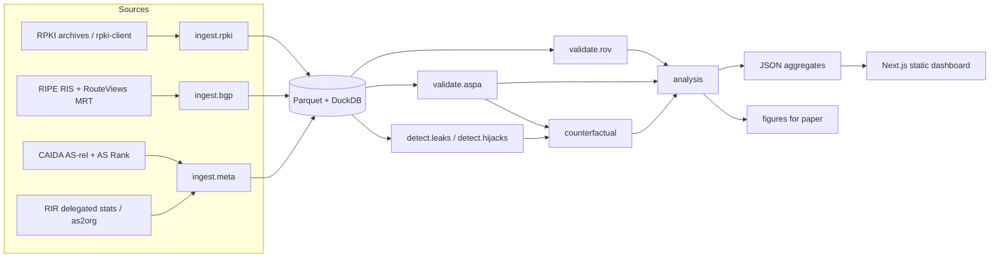

# BGPShield: Measuring BGP Route-Security Adoption and Impact

> Renamed 2026-09-19 to "BGPShield", the name of the GitHub repository. This document was
> originally titled "ASPA Watch"; the repository was briefly called "Disha", then "Hijax"
> (2026-09-18). The project, the Python package and the CLI are all `bgpshield`.

**Implementation plan for Claude Code**
Owner: Tanishka Jangir · Started: September 2026 · Target: preprint + public dashboard by September 2027

---

## 0. How to use this document (instructions for Claude Code)

This is a **research measurement project**, not a product. Correctness and reproducibility matter more than features.

Rules for the coding agent:

1. **Work one phase at a time** (Section 11). Do not start a phase until the previous phase's acceptance criteria pass.
2. **Verify every external fact before you depend on it.** URLs, file formats, JSON field names and library APIs in this document were written from research and may have changed. Items marked `VERIFY` must be checked against live docs or a real downloaded sample in Phase 0. Write what you found into `docs/data-sources.md`.
3. **Never invent data or results.** If a download fails or a format is different from what is described here, stop and report it. Do not fabricate sample data, except in clearly named test fixtures under `tests/fixtures/`.
4. **Every algorithm gets unit tests with hand-built examples** before it runs on real data (Section 12).
5. **Never commit raw data.** Commit code, small fixtures, and small aggregated outputs only.
6. **Passive data only.** This project never scans, probes or sends traffic to any network.
7. **Explain as you go.** The owner is learning BGP while building this. When you implement a routing concept, add a short plain-English docstring saying what it means and cite the RFC or draft section.
8. **Ask the owner** before adding a new dependency that needs a system package, or before any step that downloads more than 5 GB.

---

## 1. Project summary

BGP, the Internet's routing protocol, believes whatever routes networks announce. Two protections are being deployed:

- **RPKI + ROV (Route Origin Validation):** signed records (ROAs) saying which network (AS) may originate which IP prefix. Stops many **origin hijacks**.
- **ASPA (Autonomous System Provider Authorization):** signed records where an AS lists its upstream providers. Lets receivers detect **route leaks** and forged paths. Real deployment started only in 2025–26.

This project builds a reproducible pipeline that measures ASPA adoption, checks real BGP paths against published ASPA records, and asks whether ASPA would have stopped real route leaks.

## 2. Research questions

| ID | Question | Main output |
| --- | --- | --- |
| RQ1 | **Adoption:** Who publishes ASPA objects, and how is this changing over time, by RIR, country and network size? | Time series + breakdown tables |
| RQ2 | **Correctness:** Are published ASPA provider lists complete? How many *legitimate* routes would be marked Invalid because of incomplete ASPA records? | False-positive risk estimate |
| RQ3 | **Impact:** For route leaks seen in public BGP data, would ASPA have blocked them, and where on the path, under today's deployment and under "what if the top-N networks adopted" scenarios? | Counterfactual results table |
| RQ4 | **Regional lens:** How do India and the APNIC region compare with the global picture for RQ1–RQ3? | Regional section of the paper and dashboard |

ROV status (Valid/Invalid/NotFound per route) is computed too, as context and as a baseline for comparison.

## 3. Background primer (short)

- **AS (Autonomous System):** one network (Jio, Airtel, Google) with a number (ASN).
- **Prefix:** a block of IP addresses, e.g. `203.0.113.0/24`.
- **AS_PATH:** the list of ASes a route passed through. In a BGP message, the **leftmost AS is the most recent (the neighbor)** and the **rightmost is the origin**.
- **Relationships:** customer→provider (c2p: customer pays), provider→customer (p2c), peer↔peer (p2p: settlement-free).
- **Valley-free rule (Gao–Rexford):** a valid path goes *up* (c2p) zero or more times, *across* (p2p) at most once, then *down* (p2c) zero or more times. A path that goes down or across and then up again has a "valley". This is a **route leak** (RFC 7908).
- **VRP (Validated ROA Payload):** a `(prefix, maxLength, ASN)` triple produced by a validator from ROAs.
- **VAP / ASPA record:** `(customer ASN → set of provider ASNs)` produced by a validator from ASPA objects.

Primary references (read the exact current versions and pin them in `docs/references.md`):

- RFC 6480: RPKI architecture
- RFC 6811: BGP prefix origin validation
- RFC 9319: the maxLength recommendation
- RFC 7908: route leak taxonomy
- RFC 7607: AS 0 handling
- `draft-ietf-sidrops-aspa-profile`: the ASPA object format
- `draft-ietf-sidrops-aspa-verification`: the ASPA path verification procedure (**the key spec for this project**) `VERIFY latest version number`

## 4. Non-goals

- No live BGP router, BGP session or route-server participation.
- No active scanning or data-plane measurement (no traceroutes, no RIPE Atlas in v1).
- No BGPsec.
- No real-time alerting service. Batch analysis is enough.
- No ML models. Detection is rule-based and explainable.

## 5. Architecture



Batch flow per snapshot date `D`:

1. Ingest RPKI (VRPs + ASPA records) for `D`.
2. Ingest BGP RIB snapshots for `D` from the selected collectors.
3. Ingest the relationship and metadata files valid for `D` (CAIDA is monthly, so use the latest file dated on or before `D`).
4. Normalize paths.
5. Validate each (prefix, path) against ROV and ASPA.
6. Detect leaks and hijacks.
7. Aggregate and write outputs.

Incident analysis uses BGP **update** files for a time window instead of daily RIBs.

## 6. Tech stack

| Concern | Choice | Why |
| --- | --- | --- |
| Language | Python 3.12 | Owner's strength |
| Env / packaging | `uv` + `pyproject.toml` | Fast, reproducible lockfile |
| CLI | `typer` | Simple subcommands |
| MRT parsing | `pybgpkit` (pip wheel, Rust core) `VERIFY current API` | No C library to build. `pybgpstream` is an optional alternative but needs `libbgpstream` installed |
| Collector file discovery | BGPKIT Broker (via `pybgpkit`) `VERIFY` | Lists RIB/update file URLs by time and collector |
| RPKI data | Archived `rpki-client` JSON snapshots (e.g. rpkiviews.org) `VERIFY`; fallback: run `rpki-client` or `routinator` locally | Allows historical backfill |
| Storage | Parquet files + DuckDB | Laptop-friendly, fast SQL, no server |
| Dataframes | `polars` | Fast; works well with Parquet |
| Prefix matching | `pytricia` or a custom radix trie `VERIFY install on Py3.12`; fallback: `py-radix` | Longest-prefix / covering lookups for ROV |
| Config / models | `pydantic` v2 | Typed configs and records |
| Tests | `pytest`, `hypothesis` (property tests) | Algorithm correctness |
| Lint / format / types | `ruff`, `mypy --strict` on `src/` | |
| Figures | `matplotlib` | Paper-quality static figures |
| Dashboard | Next.js (static export) + Recharts, deployed free on GitHub Pages or Vercel Hobby | Owner's strength; reads precomputed JSON only |
| Scheduling | GitHub Actions cron (public repo) for the daily RPKI + small aggregate job; heavy BGP jobs run locally | Free |

## 7. Repository layout

```
bgpshield/
├── README.md
├── CLAUDE.md                  # short rules from Section 0
├── pyproject.toml
├── config/
│   ├── default.yaml           # collectors, dates, paths, scenario params
│   └── incidents.yaml         # curated incident list (Section 14)
├── docs/
│   ├── data-sources.md        # verified URLs/formats (Phase 0 output)
│   ├── references.md          # pinned RFC/draft versions
│   ├── methodology.md         # grows into the paper's method section
│   └── decisions.md           # dated log of design decisions
├── src/bgpshield/
│   ├── cli.py
│   ├── config.py
│   ├── models.py              # pydantic/dataclass records
│   ├── ingest/
│   │   ├── rpki.py            # VRPs + ASPA records → parquet
│   │   ├── bgp.py             # MRT RIB/updates → parquet
│   │   └── meta.py            # CAIDA as-rel, AS rank, country, org
│   ├── paths.py               # AS_PATH normalization
│   ├── validate/
│   │   ├── rov.py
│   │   └── aspa.py
│   ├── detect/
│   │   ├── leaks.py
│   │   └── hijacks.py
│   ├── counterfactual.py
│   ├── analysis/
│   │   ├── adoption.py        # RQ1
│   │   ├── correctness.py     # RQ2
│   │   ├── impact.py          # RQ3
│   │   └── regional.py        # RQ4
│   └── export.py              # JSON for dashboard
├── tests/
│   ├── fixtures/
│   ├── test_paths.py
│   ├── test_rov.py
│   ├── test_aspa.py
│   ├── test_leaks.py
│   └── test_counterfactual.py
├── notebooks/                 # exploration only, never imported by src
├── web/                       # Next.js dashboard
├── data/                      # gitignored: raw/, interim/, processed/
└── .github/workflows/
    ├── ci.yml                 # lint, types, tests
    └── daily-rpki.yml         # daily RPKI snapshot + adoption aggregates
```

## 8. Data sources

All free and public. **Every row must be confirmed in Phase 0**, with the result written to `docs/data-sources.md`: the exact URL pattern, file format, and a sample of real records.

| Data | Source | Granularity | Notes |
| --- | --- | --- | --- |
| BGP RIB dumps + updates | RIPE RIS (`https://data.ris.ripe.net/`), RouteViews (`https://archive.routeviews.org/`) | RIS RIBs every 8 h, updates every 5 min; RouteViews RIBs every 2 h, updates every 15 min `VERIFY` | MRT format. Discover URLs through the BGPKIT Broker |
| Historical RPKI (VRPs + ASPA) | rpkiviews.org archives of `rpki-client` output `VERIFY: coverage dates, ASPA field presence` | Several snapshots per day | Use one snapshot per day (closest to 00:00 UTC) |
| Historical ROAs (fallback) | RIPE NCC RPKI archive `https://ftp.ripe.net/rpki/` `VERIFY` | Daily per trust anchor | May lack ASPA |
| Live RPKI (fallback) | Run `rpki-client -j` or `routinator` locally (Routinator needs ASPA explicitly enabled `VERIFY flag`) | On demand | Takes a while to sync; needs rsync/RRDP access |
| AS relationships | CAIDA `https://publicdata.caida.org/datasets/as-relationships/serial-2/` (`YYYYMMDD.as-rel2.txt.bz2`) | Monthly | Format `a\|b\|rel\|source`; `-1` = a is provider of b, `0` = peers `VERIFY` |
| Customer cone / AS size | CAIDA AS Rank (API or dataset) `VERIFY` | Monthly | Used to pick "top-N" networks |
| AS → country | RIR delegated-extended stats files (all 5 RIRs) `VERIFY URLs` | Daily | Registration country, *not* where the network operates. State this in the paper |
| AS → organisation (siblings) | CAIDA AS-to-Org dataset `VERIFY` | Quarterly | Needed to avoid calling sibling ASes leakers |
| AS → RIR | Same delegated files | | |
| Incident ground truth | Operator post-mortems, news, and past measurement papers (Section 14) | Per event | Curated by hand in `config/incidents.yaml` |

### Collector selection

Do not ingest every collector. Start with **4–6 collectors** chosen for diversity. They must include at least:

- one RIS multihop collector (e.g. `rrc00`)
- one RouteViews main collector (e.g. `route-views2`)
- two collectors located in or peering heavily with the Asia-Pacific region (for RQ4)

List the available collectors through the Broker and record the choice and the reasons in `docs/decisions.md`.

### Sampling

- **Daily analysis:** one RIB per selected collector per day (the 00:00 UTC dump, or the nearest one).
- **Backfill:** weekly RIBs from the earliest date ASPA objects appear in the RPKI (`VERIFY` this date in Phase 0) up to today.
- **Incidents:** update files for `[start − 2 h, end + 2 h]`, plus the RIB just before the start.

## 9. Data model (Parquet tables)

All tables carry `snapshot_date` (DATE). Partition Parquet files by `snapshot_date`.

**`vrps`**

| column | type | notes |
| --- | --- | --- |
| prefix | string | normalized, e.g. `203.0.113.0/24` |
| afi | int8 | 4 or 6 |
| max_length | int16 | |
| asn | int64 | 0 allowed (AS0 ROA) |
| ta | string | trust anchor (afrinic/apnic/arin/lacnic/ripe) |

**`aspas`**

| column | type | notes |
| --- | --- | --- |
| customer_asn | int64 | |
| provider_asns | list[int64] | sorted, deduplicated |
| ta | string | |
| expires | timestamp | if available |

> Field names in rpki-client JSON have changed across versions: older versions used per-AFI provider lists, newer ASPA profile versions are AFI-agnostic. `VERIFY`. Write one adapter per format version and a test for each. If a snapshot has per-AFI lists, keep the union and record that decision in `docs/decisions.md`.

**`routes`** (one row per collector peer × prefix, from RIBs)

| column | type | notes |
| --- | --- | --- |
| collector | string | |
| peer_ip | string | |
| peer_asn | int64 | |
| prefix | string | |
| afi | int8 | |
| as_path_raw | string | as received |
| as_path | list[int64] | normalized, **origin first** (Section 10.1) |
| has_as_set | bool | |
| origin_asn | int64 / null | null if the path ends in an AS_SET |
| timestamp | timestamp | |

**`as_rel`**: `month, as_a, as_b, rel` with `rel ∈ {p2c, p2p}` stored as a directed provider→customer pair or an unordered peer pair. Provide a lookup `rel(x, y) → {'c2p', 'p2c', 'p2p', None}` giving the relationship *from x's point of view toward y*.

**`as_meta`**: `month, asn, country, rir, org_id, cone_size, rank`.

**Results tables:**

- `rov_results`: route key + `rov_state ∈ {valid, invalid, not_found}` + `reason`
- `aspa_results`: route key + `procedure ∈ {upstream, downstream, both}` + `aspa_state ∈ {valid, invalid, unknown}` + `first_bad_hop` (nullable pair)
- `leaks`: route key + `leaker_asn` + `leak_type` + `evidence` (JSON of hop relationships)
- `hijack_candidates`: prefix + suspect origin + baseline origins + type (`origin_change` / `subprefix` / `moas`) + flags
- `counterfactual`: incident_id/route key + scenario + `blocked` (bool) + `blocking_asn` + `blocking_position`

## 10. Algorithms

### 10.1 AS_PATH normalization (`paths.py`)

Input: the raw AS_PATH as parsed (a sequence of segments: AS_SEQUENCE / AS_SET; confederation segments may appear).

1. Drop confederation segments (AS_CONFED_SEQUENCE / AS_CONFED_SET). Log how many routes had them.
2. If any AS_SET is present: set `has_as_set = True`. Keep the sequence part for relationship analysis, but ASPA verification must return **Invalid** for these paths (check the current draft wording `VERIFY`). If the path *ends* in an AS_SET, `origin_asn = null`.
3. **Collapse prepending:** consecutive duplicate ASNs become one entry.
4. **Reverse** the path so that index 1 is the origin and index N is the collector peer (the neighbor). This matches the ASPA draft's notation. **Document this convention loudly in the code**, because mixing up path direction is the most likely bug in this project.
5. Flag and exclude from analysis (but count):
   - paths with loops (an ASN appears twice non-consecutively)
   - paths containing private or reserved ASNs (RFC 6996, RFC 7300, RFC 5398; AS 23456 = AS_TRANS)
   - paths whose leftmost AS ≠ `peer_asn`. Some collectors or route servers strip their own AS, so record this rather than silently dropping.

Test with prepends, AS_SETs, loops, a single-AS path, and a 4-byte ASN.

### 10.2 ROV (`validate/rov.py`), per RFC 6811

For route `(prefix P, origin O)`:

1. Find all VRPs whose prefix **covers** P (VRP prefix length ≤ P length, and P lies inside it). Use a radix trie per AFI.
2. If none: **NotFound**.
3. If any covering VRP has `asn == O` (and O ≠ 0) and `len(P) ≤ max_length`: **Valid**.
4. Otherwise **Invalid**. Record the reason (`wrong_origin`, `too_specific`, `as0`).
5. If `origin_asn` is null (AS_SET at the end): Invalid if any VRP covers P, else NotFound.

Tests: exact match, a more-specific within maxLength, a more-specific beyond maxLength, a wrong origin, AS0, no coverage, IPv6.

### 10.3 ASPA verification (`validate/aspa.py`)

> **Implement from the text of the current `draft-ietf-sidrops-aspa-verification` (or the RFC it becomes).** The pseudocode below is a guide written from an earlier reading of the draft. If it disagrees with the spec, **the spec wins**. Record the draft version in a module constant and in `docs/references.md`. Include every worked example from the draft as a test case.

Hop check, where `VAP` = ASPA records for the snapshot:

```
def hop(x, y):                  # "is y an attested provider of x?"
    if x not in VAP:            return NO_ATTESTATION
    if y in VAP[x]:             return PROVIDER_PLUS
    return NOT_PROVIDER_PLUS
```

Path `A[1..N]`: A[1] = origin, A[N] = the AS that sent us the route (after normalization).

**Upstream verification** (the route was received from a customer, a lateral peer, or via a route server):

```
if has_as_set: return INVALID
if N == 1:     return VALID
if any hop(A[i], A[i+1]) == NOT_PROVIDER_PLUS for i in 1..N-1: return INVALID
if all hop(A[i], A[i+1]) == PROVIDER_PLUS for i in 1..N-1:     return VALID
return UNKNOWN
```

**Downstream verification** (the route was received from a provider). The path may legitimately go up and then down:

```
if has_as_set: return INVALID
if N <= 2:     return VALID
# up-ramp: scanning from origin upward
max_up = first i in 1..N-1 with hop(A[i],A[i+1]) == NOT_PROVIDER_PLUS, else N
min_up = first i in 1..N-1 with hop(A[i],A[i+1]) != PROVIDER_PLUS,     else N
# down-ramp: scanning from the neighbor end downward
max_down = N - j + 1 for the largest j in 2..N with hop(A[j],A[j-1]) == NOT_PROVIDER_PLUS, else N
min_down = N - j + 1 for the largest j in 2..N with hop(A[j],A[j-1]) != PROVIDER_PLUS,     else N
if max_up + max_down < N: return INVALID
if min_up + min_down < N: return UNKNOWN
return VALID
```

Also return **`first_bad_hop`**: the (x, y) pair that caused Invalid. This is useful for RQ2 debugging.

#### Applying ASPA at a route collector

A collector is not a real router, so we **evaluate the check that the collector peer A[N] would perform** on the route it received from A[N-1], using the path `A[1..N-1]`:

- `rel(A[N], A[N-1])` = A[N-1] is A[N]'s customer or peer → **upstream** procedure.
- A[N-1] is A[N]'s provider → **downstream** procedure.
- Relationship unknown → run **both** and store both results (`procedure = both`). Report these routes separately.

**Hop-by-hop ("where would it be blocked") evaluation**, used in Section 10.6: for each k in 2..N, evaluate the path `A[1..k-1]` as received by `A[k]`, choosing the procedure from `rel(A[k], A[k-1])`. The first k with an Invalid result is the earliest point where an ASPA-filtering AS could have dropped the route.

Property tests with `hypothesis`:

- When every AS on the path has a complete, correct ASPA and the path is valley-free by construction, the result is never INVALID.
- Adding a provider to some AS's ASPA never turns VALID into INVALID (monotonicity). `VERIFY` that this holds for the spec version you implement. If it does not, note that in `docs/decisions.md` and drop the property.

### 10.4 Route-leak detection (`detect/leaks.py`)

Independent of ASPA. Uses CAIDA relationships from the month **before** the snapshot, to avoid the relationship data being inferred from the leak itself.

For a normalized path A[1..N], compute the edge direction for each i = 1..N-1 (the route travels from A[i] to A[i+1]):

- `up`: A[i+1] is A[i]'s provider
- `down`: A[i+1] is A[i]'s customer
- `flat`: peers
- `sibling`: same organisation (as2org). Treat as transparent: merge the two ASes for this analysis.
- `unknown`: no relationship data

The path is valley-free iff the direction sequence matches `up* flat? down*` (ignoring siblings). The last edge (collector peer → collector) is not part of the path.

**Leaker:** an AS A[i] (2 ≤ i ≤ N-1) whose incoming edge (A[i-1]→A[i]) is `down` or `flat` **and** whose outgoing edge (A[i]→A[i+1]) is `up` or `flat`. Classify the leak using RFC 7908 types (at least: type 1 "hairpin" provider→customer→provider, and the peer-involved variants). Store the edge sequence as evidence.

- If an `unknown` edge sits next to the suspected valley, mark the result `undetermined`, not a leak.
- Precision guard: CAIDA inference has errors. Keep a leak candidate only if it is (a) seen from ≥ 2 collector peers, or (b) matched to a curated incident. Report both the raw counts and the filtered counts.

### 10.5 Hijack candidates (`detect/hijacks.py`), kept simple

Baseline: for each prefix, the set of origins seen in the previous 30 days of daily RIBs.

- `origin_change`: a new origin not in the baseline, and not a sibling of any baseline origin.
- `subprefix`: a more-specific of a baseline prefix with a different, non-sibling origin.
- `moas`: multiple origins at the same time.

Tag each candidate with its ROV state. **This is context for RQ3, not a main contribution.** Do not over-engineer it.

### 10.6 Counterfactual evaluation (`counterfactual.py`)

For each leaked route (from 10.4 or from a curated incident), the question is: *would it have been stopped, and where?*

**ASPA publication scenarios** (which ASes have ASPA records):

| Scenario | Records used |
| --- | --- |
| S0 | Real ASPA records on the incident date (or today's, labelled clearly for older incidents) |
| S1 | S0 + synthetic records for the top-100 ASes by customer cone |
| S2 | S0 + synthetic for top-1000 |
| S3 | Synthetic for all ASes: **upper bound only** (see threats) |

A synthetic record for AS x = all providers of x in the CAIDA file **from the month before the incident**.

**Filtering scenarios** (which ASes drop Invalid routes):

| Scenario | Filters |
| --- | --- |
| F-all | Every AS on the path filters |
| F-topN | Only the top-N transit ASes filter (N = 20, 100) |

For each (route, S, F): run the hop-by-hop evaluation (10.3). `blocked = True` if some filtering A[k] gets INVALID. Record `blocking_asn` and `blocking_position` (k / N).

**Circularity warning (must appear in code comments and the paper):** in S3, leaks detected with CAIDA relationships will be "caught" by ASPA records also built from CAIDA relationships, which is partly circular. S3 is therefore only an upper bound. The credible results are **S0 on real records** and **curated incidents with external ground truth**.

## 11. Phases, tasks and acceptance criteria

Time assumes about 6 h/week from the owner, with Claude Code doing most of the typing.

### Phase 0: Verify the ground (weeks 1–2)

- [ ] Scaffold the repo (layout from Section 7), `uv`, ruff, mypy, pytest, CI.
- [ ] Download **one real sample** of each source in Section 8 into `data/raw/samples/`.
- [ ] Record for each: the exact URL pattern, file size, format, field names, and the first 5 records → `docs/data-sources.md`.
- [ ] Confirm the `pybgpkit` API (parser iteration, filters, Broker query) with a 20-line script.
- [ ] Find the **earliest date** ASPA records appear in the archived RPKI snapshots, and count them on that date and today.
- [ ] Pin the ASPA draft/RFC versions in `docs/references.md`.

**Accept when:** every `VERIFY` item in this document is resolved or recorded as a blocker, and CI is green.

### Phase 1: RPKI ingestion + adoption baseline (weeks 3–5)

- [ ] `ingest/rpki.py`: snapshot → `vrps` and `aspas` Parquet, with a format adapter per version.
- [ ] `bgpshield ingest-rpki --date YYYY-MM-DD` and `--from/--to` for backfill.
- [ ] GitHub Action `daily-rpki.yml`: fetch today's snapshot and write the ASPA counts JSON (small) to `web/public/data/`.
- [ ] `analysis/adoption.py`: ASPA object count per day; per RIR/TA; per registration country.
- [ ] Backfill weekly from the earliest ASPA date.

**Accept when:** the ASPA count for a chosen date matches a public reference within a stated tolerance (e.g. the Hurricane Electric report or an RIR statistics page `VERIFY`), and the daily job has run 7 days in a row.

### Phase 2: BGP ingestion + path normalization (weeks 6–9)

- [ ] `ingest/bgp.py`: RIB MRT → `routes` Parquet for the chosen collectors and date (streamed, bounded memory).
- [ ] `paths.py` with its full test suite (10.1).
- [ ] `ingest/meta.py`: CAIDA as-rel, AS Rank / cone, delegated stats, as2org → `as_rel`, `as_meta`.
- [ ] Report: routes per collector, % dropped per normalization rule.

**Accept when:** one day × all selected collectors ingests on a laptop in < 1 h with < 8 GB RAM (report the real numbers), and the normalization drop rates are documented.

### Phase 3: Validators (weeks 10–14)

- [ ] `validate/rov.py` + tests (10.2).
- [ ] `validate/aspa.py` + tests, including **every example from the draft** (10.3).
- [ ] Collector procedure selection + the hop-by-hop evaluator.
- [ ] Sanity check of ROV: the share of Invalid routes for the date should be in the same range as public ROV statistics (e.g. RIPE/Cloudflare/NIST RPKI monitors `VERIFY which exists`). Write down the comparison.
- [ ] `analysis/adoption.py` extended: the share of routes whose path has ≥ 1 AS with an ASPA record, by position.

**Accept when:** all tests pass, a reviewer can trace three randomly sampled ASPA-Invalid routes by hand in a notebook, and the ROV sanity check is documented.

### Phase 4: Correctness study, RQ2 (weeks 15–18)

- [ ] For each ASPA-publishing AS: compare its provider set with CAIDA-inferred providers → missing providers, extra providers.
- [ ] Count ASPA-Invalid routes that are **not** leaks according to 10.4 (likely false positives caused by incomplete records).
- [ ] Manually review the top 20 ASes causing Invalid results. Use PeeringDB and IRR data only for reading, and write notes in `docs/methodology.md`.

**Accept when:** there is a table of "ASPA records likely incomplete" with evidence, and the manual review notes exist.

### Phase 5: Leak detection + incidents, RQ3 (weeks 19–26)

- [ ] `detect/leaks.py` + tests with synthetic topologies.
- [ ] `detect/hijacks.py` (simple).
- [ ] Build `config/incidents.yaml` (Section 14) and ingest update-file windows for each incident.
- [ ] Validate the detector: does it flag each curated leak? Report recall on curated incidents and precision on a manually labelled random sample of 50 detected leaks.
- [ ] `counterfactual.py` with all scenario combinations.
- [ ] Results table: per incident × scenario → blocked?, where.

**Accept when:** the recall/precision numbers are written down honestly (whatever they are), and the counterfactual runs end to end for all incidents.

### Phase 6: Longitudinal run + regional lens, RQ1 + RQ4 (weeks 27–36, runs in the background)

- [ ] Weekly RIB snapshots across the whole period → ROV/ASPA/leak aggregates over time.
- [ ] `analysis/regional.py`: India (registration country IN), the APNIC region, and global. Highlight the largest Indian transit ASes by cone and their ASPA/ROV status.
- [ ] Figures for the paper (`matplotlib`, saved to `figures/`).

**Accept when:** the figures regenerate from a single command (`bgpshield report`).

### Phase 7: Dashboard + write-up (weeks 37–48)

- [ ] `export.py` → small JSON files (< 5 MB total) in `web/public/data/`.
- [ ] Next.js static site pages:
    - Overview (adoption over time)
    - Networks (searchable AS table: ROA/ASPA status, provider-set mismatch)
    - Incidents (per-incident counterfactual)
    - Region (India/APNIC)
    - Methodology
- [ ] Deploy to GitHub Pages or Vercel Hobby.
- [ ] Tag `v1.0`, archive it on Zenodo for a DOI, and write the arXiv preprint.
- [ ] Optional: submit a lightning talk to IN-NOG / APNIC / RIPE.

**Accept when:** someone can clone the repo, run `make reproduce-small` (one date, one collector) in under 30 minutes, and get the same numbers as the committed fixtures.

## 12. Testing strategy

- **Unit tests with hand-built topologies.** Create a tiny fixture world:

  ```
  AS1 (origin) --c2p--> AS2 --c2p--> AS3 (tier-1)
  AS3 --p2p-- AS4 (tier-1)
  AS4 --p2c--> AS5 --p2c--> AS6
  AS2 --c2p--> AS7 (second provider of AS2)
  ```

  Then write cases for:
  - the valid path 1-2-3-4-5-6
  - a leak via AS2 (a route learned from AS3 sent to AS7)
  - incomplete ASPA (AS2 lists only AS3), so a legitimate path via AS7 is Invalid
  - no ASPA anywhere, which gives Unknown
- **Draft examples** as parameterized tests (10.3).
- **Property tests** (10.3).
- **Golden-file test:** a tiny real MRT file (a few hundred routes, committed under `tests/fixtures/`) → the expected `routes` Parquet row count and a few spot values.
- **Regression:** `bgpshield reproduce` compares its output with the committed aggregate
  fixtures. It is run by hand rather than in CI, because it downloads about 66 MB and takes
  minutes; CI runs lint, format, types, tests and a CLI smoke check.
- Coverage target: ≥ 90% for `paths.py`, `validate/`, `detect/`, `counterfactual.py`.

## 13. Metrics (what goes in the paper)

| RQ | Metric |
| --- | --- |
| RQ1 | ASPA objects over time; % of routed ASes publishing; % weighted by customer cone and by prefixes originated; breakdown by RIR and country; % of routes with ≥ 1 ASPA-covered hop |
| RQ1 context | ROA coverage (% of routes Valid/Invalid/NotFound) over time |
| RQ2 | % of ASPA publishers whose provider set misses ≥ 1 CAIDA-inferred provider; # of legitimate routes turned Invalid by incomplete records (false-positive risk) |
| RQ3 | Per scenario: % of detected leaks blocked; median blocking position; per curated incident: blocked yes/no + blocking AS |
| RQ4 | All of the above for IN and APNIC vs global; the top Indian transit ASes' status |

Every number must be reproducible from a CLI command. Record that command next to the number in `docs/methodology.md`.

## 14. Curated incidents (starting list, **every item `VERIFY`** from primary reports)

Collect for each: date/time window (UTC), leaker or hijacker ASN, affected prefixes, and at least one public post-mortem link.

- June 2019 route leak involving a small ISP, a steel company's network and a large US transit provider (widely reported by Cloudflare)
- April 2021 route leak from a large Indian network (Vodafone Idea, reported as ~30k prefixes)
- April 2018 hijack of DNS provider prefixes to steal cryptocurrency (Route 53 / MyEtherWallet)
- August 2017 Google route leak affecting Japan
- January 2024 incident where a compromised RIPE NCC account was used to publish bad RPKI objects (Orange Spain)
- Plus 3–5 recent (2025–26) leaks from operator blogs or public BGP monitors

> Older incidents predate ASPA. For them, S0 means "today's ASPA records applied to the old path", and the paper must say so plainly.

## 15. Threats to validity (keep updated; becomes a paper section)

- **Relationship inference errors** (CAIDA): these affect leak detection and synthetic ASPA records. Mitigations: previous-month data, multi-vantage requirement, a manual precision sample.
- **Circularity** in S3 (10.6).
- **Collector visibility bias:** collectors see mostly large networks and full-table peers. Leaks confined to one region may be invisible.
- **Collector perspective ≠ real router:** we simulate the peer's check without knowing its configuration.
- **Registration country ≠ operating country.**
- **Spec drift:** ASPA verification rules changed across draft versions. Pin the version.
- **Snapshot timing:** a daily RIB misses short-lived events. Incidents use update files.

## 16. Resource budget

- **Disk:** keep `data/raw` under ~100 GB. Delete raw MRT after converting to Parquet; keep only Parquet.
- **RAM:** stream MRT; never load a whole RIB into pandas.
- **Money:** ₹0. No paid cloud. GitHub Actions only for small daily jobs.
- **Network etiquette:** respect archive rate limits, cache downloads, and set a descriptive User-Agent with a contact email.

## 17. CLI (target)

```
bgpshield ingest-rpki   --date D | --from D1 --to D2 [--every 7d]
bgpshield ingest-bgp    --date D --collectors rrc00,route-views2 [--limit N] [--jobs N]
bgpshield ingest-meta   --month YYYY-MM
bgpshield validate      --date D
bgpshield detect        --date D
bgpshield incidents     [--id ID]
bgpshield counterfactual --scenarios S0,S1,S2,S3 --filters F-all,F-top20
bgpshield report        # figures + tables
bgpshield export        # dashboard JSON
```

## 18. Learning map (owner reads while each phase is built)

| Phase | Read |
| --- | --- |
| 0–1 | Kurose & Ross, *Computer Networking*, ch. 5 (BGP); RFC 6480; APNIC/Cloudflare RPKI explainers |
| 2 | Gao, "On Inferring Autonomous System Relationships in the Internet" (2001); the CAIDA AS-relationships dataset documentation; MRT format RFC 6396 (skim) |
| 3 | RFC 6811, RFC 9319; the ASPA profile and verification drafts, in full |
| 4 | NDSS 2025 "Securing BGP ASAP: ASPA and other Post-ROV Defenses" |
| 5 | RFC 7908; RoVista (IMC 2023); ARTEMIS (hijack detection) paper |
| 6 | Paxson, "Strategies for Sound Internet Measurement" (IMC 2004); IMC 2025 "ru-RPKI-ready" |
| 7 | Two IMC short papers end to end, as models for the write-up |

Open-source contributions to aim for along the way: `pybgpkit` and `pybgpstream` (Python), plus small bug reports or docs fixes found while using BGPKIT or rpki-client.

## 19. Open questions for the owner

1. Collectors: accept the diversity rule in Section 8, or target specific Indian IXPs if a collector exists there?
2. Dashboard hosting: GitHub Pages or Vercel?
3. ~~Project name: keep "ASPA Watch" or choose another?~~ **Answered 2026-09-18: "Hijax",
   then renamed 2026-09-19 to "BGPShield" to match the GitHub repository (D-066).**
4. Paper target: arXiv preprint only, or also a workshop/short-paper venue (e.g. PAM or IMC poster track) if the results are strong?
